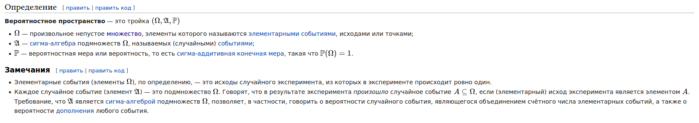
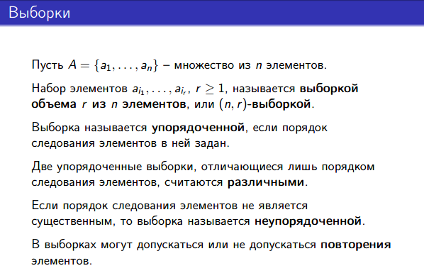
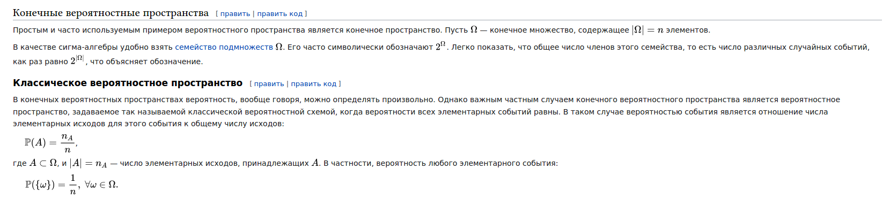
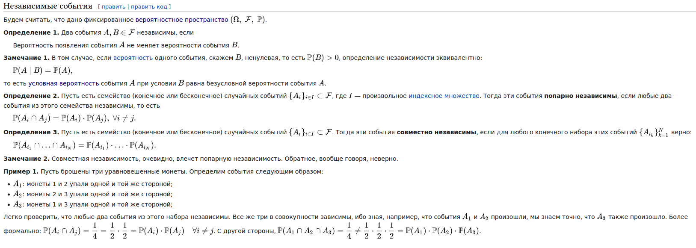
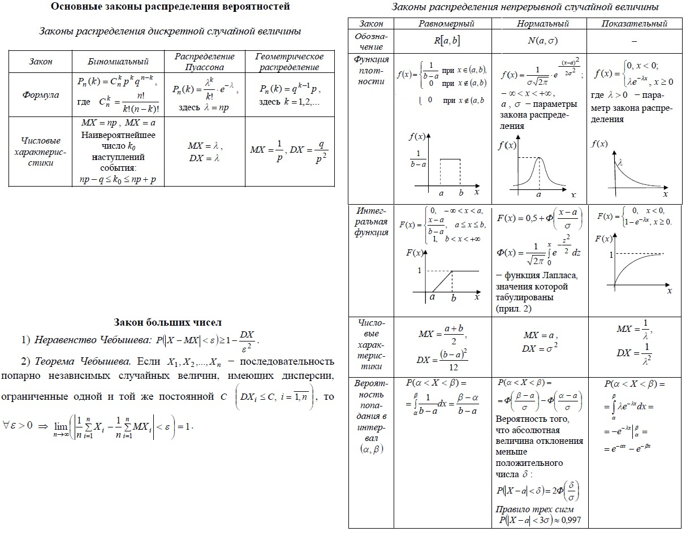

### 1.1. Теория вероятностей и случайные процессы

[Курс на степике по теорверу](https://stepik.org/course/3089/promo)

1. [Основные понятия теории вероятностей](#вопрос-1). Определение вероятностного пространства, простейшие дискретные случаи (выборки с порядком и без него, упорядоченные и неупорядоченные), классическая вероятностная модель. Случайная величина, функция распределения.

2. [Условные вероятности](#вопрос-2). Определение условной вероятности, формула полной вероятности, формула Байеса.

3. [Математическое ожидание, дисперсия, корреляция](#вопрос-3). Определение математического ожидания, дисперсии, ковариации и корреляции, их свойства.

4. [Независимость событий](#вопрос-4). Попарная независимость и независимость в совокупности.

5. [Основные теоремы теории вероятностей](#вопрос-5). Неравенство Чебышева. Закон больших чисел. Центральная предельная теорема.

6. [Распределения](#вопрос-6). Стандартные дискретные и непрерывные распределения, их математические ожидания, дисперсии и свойства: биномиальное, равномерное, нормальное, пуассоновское, показательное, геометрическое.

### Вопрос 1

**Основные понятия теории вероятностей. Определение вероятностного пространства, простейшие дискретные случаи (выборки с порядком и без него, упорядоченные и неупорядоченные), классическая вероятностная модель. Случайная величина, функция распределения.**

[Дискретные вероятностные пространства](http://www.machinelearning.ru/wiki/index.php?title=%D0%92%D0%B5%D1%80%D0%BE%D1%8F%D1%82%D0%BD%D0%BE%D1%81%D1%82%D0%BD%D0%BE%D0%B5_%D0%BF%D1%80%D0%BE%D1%81%D1%82%D1%80%D0%B0%D0%BD%D1%81%D1%82%D0%B2%D0%BE#.D0.94.D0.B8.D1.81.D0.BA.D1.80.D0.B5.D1.82.D0.BD.D1.8B.D0.B5_.D0.B2.D0.B5.D1.80.D0.BE.D1.8F.D1.82.D0.BD.D0.BE.D1.81.D1.82.D0.BD.D1.8B.D0.B5_.D0.BF.D1.80.D0.BE.D1.81.D1.82.D1.80.D0.B0.D0.BD.D1.81.D1.82.D0.B2.D0.B0)

### Вопрос 2

**Условные вероятности. Определение условной вероятности, формула полной вероятности, формула Байеса.**

[Условная вероятность](https://neerc.ifmo.ru/wiki/index.php?title=%D0%A3%D1%81%D0%BB%D0%BE%D0%B2%D0%BD%D0%B0%D1%8F_%D0%B2%D0%B5%D1%80%D0%BE%D1%8F%D1%82%D0%BD%D0%BE%D1%81%D1%82%D1%8C)

[Формула полной вероятности](https://neerc.ifmo.ru/wiki/index.php?title=%D0%A4%D0%BE%D1%80%D0%BC%D1%83%D0%BB%D0%B0_%D0%BF%D0%BE%D0%BB%D0%BD%D0%BE%D0%B9_%D0%B2%D0%B5%D1%80%D0%BE%D1%8F%D1%82%D0%BD%D0%BE%D1%81%D1%82%D0%B8)

[Формула Байеса](https://neerc.ifmo.ru/wiki/index.php?title=%D0%A4%D0%BE%D1%80%D0%BC%D1%83%D0%BB%D0%B0_%D0%91%D0%B0%D0%B9%D0%B5%D1%81%D0%B0)

### Вопрос 3

**Математическое ожидание, дисперсия, корреляция. Определение математического ожидания, дисперсии, ковариации и корреляции, их свойства.**

[Мат ожидание](https://neerc.ifmo.ru/wiki/index.php?title=%D0%9C%D0%B0%D1%82%D0%B5%D0%BC%D0%B0%D1%82%D0%B8%D1%87%D0%B5%D1%81%D0%BA%D0%BE%D0%B5_%D0%BE%D0%B6%D0%B8%D0%B4%D0%B0%D0%BD%D0%B8%D0%B5_%D1%81%D0%BB%D1%83%D1%87%D0%B0%D0%B9%D0%BD%D0%BE%D0%B9_%D0%B2%D0%B5%D0%BB%D0%B8%D1%87%D0%B8%D0%BD%D1%8B)

[Дисперсия](https://neerc.ifmo.ru/wiki/index.php?title=%D0%94%D0%B8%D1%81%D0%BF%D0%B5%D1%80%D1%81%D0%B8%D1%8F_%D1%81%D0%BB%D1%83%D1%87%D0%B0%D0%B9%D0%BD%D0%BE%D0%B9_%D0%B2%D0%B5%D0%BB%D0%B8%D1%87%D0%B8%D0%BD%D1%8B)

[Корреляция](https://neerc.ifmo.ru/wiki/index.php?title=%D0%9A%D0%BE%D1%80%D1%80%D0%B5%D0%BB%D1%8F%D1%86%D0%B8%D1%8F_%D1%81%D0%BB%D1%83%D1%87%D0%B0%D0%B9%D0%BD%D1%8B%D1%85_%D0%B2%D0%B5%D0%BB%D0%B8%D1%87%D0%B8%D0%BD)

### Вопрос 4

**Независимость событий. Попарная независимость и независимость в совокупности.**

[Попарная независимость и независимость в совокупности](https://ru.wikipedia.org/wiki/%D0%9F%D0%BE%D0%BF%D0%B0%D1%80%D0%BD%D0%B0%D1%8F_%D0%BD%D0%B5%D0%B7%D0%B0%D0%B2%D0%B8%D1%81%D0%B8%D0%BC%D0%BE%D1%81%D1%82%D1%8C)

### Вопрос 5

**Основные теоремы теории вероятностей. Неравенство Чебышева. Закон больших чисел. Центральная предельная теорема.**

[Неравенство Чебышёва](https://neerc.ifmo.ru/wiki/index.php?title=%D0%9D%D0%B5%D1%80%D0%B0%D0%B2%D0%B5%D0%BD%D1%81%D1%82%D0%B2%D0%BE_%D0%9C%D0%B0%D1%80%D0%BA%D0%BE%D0%B2%D0%B0)

[Закон больших чисел](https://ru.wikipedia.org/wiki/%D0%97%D0%B0%D0%BA%D0%BE%D0%BD_%D0%B1%D0%BE%D0%BB%D1%8C%D1%88%D0%B8%D1%85_%D1%87%D0%B8%D1%81%D0%B5%D0%BB)

[Центральная предельная теорема](https://ru.wikipedia.org/wiki/%D0%A6%D0%B5%D0%BD%D1%82%D1%80%D0%B0%D0%BB%D1%8C%D0%BD%D0%B0%D1%8F_%D0%BF%D1%80%D0%B5%D0%B4%D0%B5%D0%BB%D1%8C%D0%BD%D0%B0%D1%8F_%D1%82%D0%B5%D0%BE%D1%80%D0%B5%D0%BC%D0%B0)

### Вопрос 6

**Распределения. Стандартные дискретные и непрерывные распределения, их математические ожидания, дисперсии и свойства: биномиальное, равномерное, нормальное, пуассоновское, показательное, геометрическое.**

[Распределения](https://ru.wikipedia.org/wiki/%D0%A0%D0%B0%D1%81%D0%BF%D1%80%D0%B5%D0%B4%D0%B5%D0%BB%D0%B5%D0%BD%D0%B8%D0%B5_%D0%B2%D0%B5%D1%80%D0%BE%D1%8F%D1%82%D0%BD%D0%BE%D1%81%D1%82%D0%B5%D0%B9)

Распределения:

[Биномиальное](http://mathprofi.ru/binomialnoe_raspredelenie_veroyatnostei.html)

[Равномерное](http://mathprofi.ru/ravnomernoe_raspredelenie_veroyatnostei.html)

[Нормальное](http://mathprofi.ru/normalnoe_raspredelenie_veroyatnostei.html)

[Пуассоновское](http://mathprofi.ru/raspredelenie_i_formula_puassona.html)

[Показательное](http://mathprofi.ru/pokazatelnoe_raspredelenie_veroyatnostei.html)

[Геометрическое](http://mathprofi.ru/geometricheskoe_raspredelenie_veroyatnostei.html)
