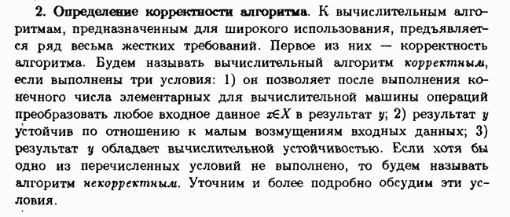
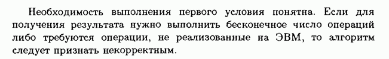

### 1.2. Алгоритмы

[Консультация 2016](https://www.youtube.com/watch?v=2ByGYBDAULY)

[Консультация 2017](https://www.youtube.com/watch?v=5sQ9P4OXOwg)

[Еджадж физтеха](http://ejudge.mipt.ru/) -- потренироваться.

[ACM MIPT](http://acm.mipt.ru/)

[Быстрый страт в спортпрогу](https://stepik.org/course/64454/syllabus) -- потренироваться.

1. [Анализ алгоритмов](#вопрос-1). Понятие о сложности по времени и по памяти. Асимптотика, О-символика. Доказательство корректности алгоритмов.

2. [Строки и операции над ними](#вопрос-2). Представление строк. Вычисление длины, конкатенация. Алгоритмы поиска подстроки в строке.

3. [Сортировки](#вопрос-3). Нижняя теоретико-информационная оценка сложности задачи сортировки. Алгоритмы сортировки вставками, пузырьком, быстрая сортировка, сортировка слиянием. Оценка сложности.

4. [Представление матриц и векторов](#вопрос-4). Алгоритмы умножения матриц и эффективные способы их реализации. Численные методы решения систем линейных уравнений.

5. [Численное дифференцирование и интегрирование](#вопрос-5). Численные методы для решения систем дифференциальных уравнений.

6. [Граф](#вопрос-6). Ориентированный граф. Представления графа. Обход графа в глубину и в ширину. Топологическая сортировка. Подсчет числа путей в орграфе.

7. [Алгоритмы поиска кратчайших путей в графе](#вопрос-7). Алгоритм Дейкстры. Алгоритм Форда-Беллмана. Алгоритм Флойда. Алгоритм A star.

8. [Недетерминированные конечные автоматы, различные варианты определения](#вопрос-8). Детерминированные конечные автоматы. Их эквивалентность. Машина Тьюринга.

### Вопрос 1

**Анализ алгоритмов. Понятие о сложности по времени и по памяти. Асимптотика, О-символика. Доказательство корректности алгоритмов.**

[Сложность алгоритма](https://ru.wikipedia.org/wiki/%D0%92%D1%8B%D1%87%D0%B8%D1%81%D0%BB%D0%B8%D1%82%D0%B5%D0%BB%D1%8C%D0%BD%D0%B0%D1%8F_%D1%81%D0%BB%D0%BE%D0%B6%D0%BD%D0%BE%D1%81%D1%82%D1%8C)

[Асимптотика, О-символика](https://habr.com/ru/post/188010/)

[О-большое, о-малое](https://ru.wikipedia.org/wiki/%C2%ABO%C2%BB_%D0%B1%D0%BE%D0%BB%D1%8C%D1%88%D0%BE%D0%B5_%D0%B8_%C2%ABo%C2%BB_%D0%BC%D0%B0%D0%BB%D0%BE%D0%B5)

### Вопрос 2

**Строки и операции над ними. Представление строк. Вычисление длины, конкатенация. Алгоритмы поиска подстроки в строке.**

[Строковый тип и представление строк](https://ru.wikipedia.org/wiki/%D0%A1%D1%82%D1%80%D0%BE%D0%BA%D0%BE%D0%B2%D1%8B%D0%B9_%D1%82%D0%B8%D0%BF)

[Поиск подстроки в строке](https://neerc.ifmo.ru/wiki/index.php?title=%D0%9F%D0%BE%D0%B8%D1%81%D0%BA_%D0%BF%D0%BE%D0%B4%D1%81%D1%82%D1%80%D0%BE%D0%BA%D0%B8_%D0%B2_%D1%81%D1%82%D1%80%D0%BE%D0%BA%D0%B5)

### Вопрос 3

**Сортировки. Нижняя теоретико-информационная оценка сложности задачи сортировки. Алгоритмы сортировки вставками, пузырьком, быстрая сортировка, сортировка слиянием. Оценка сложности.**

[Сортировки](https://neerc.ifmo.ru/wiki/index.php?title=%D0%A1%D0%BE%D1%80%D1%82%D0%B8%D1%80%D0%BE%D0%B2%D0%BA%D0%B8)

[Оценка сложности сортировок сравнением](https://neerc.ifmo.ru/wiki/index.php?title=%D0%A2%D0%B5%D0%BE%D1%80%D0%B5%D0%BC%D0%B0_%D0%BE_%D0%BD%D0%B8%D0%B6%D0%BD%D0%B5%D0%B9_%D0%BE%D1%86%D0%B5%D0%BD%D0%BA%D0%B5_%D0%B4%D0%BB%D1%8F_%D1%81%D0%BE%D1%80%D1%82%D0%B8%D1%80%D0%BE%D0%B2%D0%BA%D0%B8_%D1%81%D1%80%D0%B0%D0%B2%D0%BD%D0%B5%D0%BD%D0%B8%D1%8F%D0%BC%D0%B8)

[Пузырек](https://neerc.ifmo.ru/wiki/index.php?title=%D0%A1%D0%BE%D1%80%D1%82%D0%B8%D1%80%D0%BE%D0%B2%D0%BA%D0%B0_%D0%BF%D1%83%D0%B7%D1%8B%D1%80%D1%8C%D0%BA%D0%BE%D0%BC)

[Вставками](https://neerc.ifmo.ru/wiki/index.php?title=%D0%A1%D0%BE%D1%80%D1%82%D0%B8%D1%80%D0%BE%D0%B2%D0%BA%D0%B0_%D0%B2%D1%81%D1%82%D0%B0%D0%B2%D0%BA%D0%B0%D0%BC%D0%B8)

[Квик](https://neerc.ifmo.ru/wiki/index.php?title=%D0%91%D1%8B%D1%81%D1%82%D1%80%D0%B0%D1%8F_%D1%81%D0%BE%D1%80%D1%82%D0%B8%D1%80%D0%BE%D0%B2%D0%BA%D0%B0)

[Слиянием](https://neerc.ifmo.ru/wiki/index.php?title=%D0%A1%D0%BE%D1%80%D1%82%D0%B8%D1%80%D0%BE%D0%B2%D0%BA%D0%B0_%D1%81%D0%BB%D0%B8%D1%8F%D0%BD%D0%B8%D0%B5%D0%BC)

### Вопрос 4

**Представление матриц и векторов. Алгоритмы умножения матриц и эффективные способы их реализации. Численные методы решения систем линейных уравнений.**

Алгоритмы умножения матриц:

[Наивный алгортм](https://prog-cpp.ru/matrix-multiplication/)

[Алгоритм Штрассена](https://ru.wikipedia.org/wiki/%D0%90%D0%BB%D0%B3%D0%BE%D1%80%D0%B8%D1%82%D0%BC_%D0%A8%D1%82%D1%80%D0%B0%D1%81%D1%81%D0%B5%D0%BD%D0%B0)

[Алгоритм Винограда](https://ru.wikipedia.org/wiki/%D0%90%D0%BB%D0%B3%D0%BE%D1%80%D0%B8%D1%82%D0%BC_%D0%9A%D0%BE%D0%BF%D0%BF%D0%B5%D1%80%D1%81%D0%BC%D0%B8%D1%82%D0%B0_%E2%80%94_%D0%92%D0%B8%D0%BD%D0%BE%D0%B3%D1%80%D0%B0%D0%B4%D0%B0)

Численные методы решения СЛАУ:

[Метод Гаусса](https://ru.wikipedia.org/wiki/%D0%9C%D0%B5%D1%82%D0%BE%D0%B4_%D0%93%D0%B0%D1%83%D1%81%D1%81%D0%B0_%E2%80%94_%D0%97%D0%B5%D0%B9%D0%B4%D0%B5%D0%BB%D1%8F_%D1%80%D0%B5%D1%88%D0%B5%D0%BD%D0%B8%D1%8F_%D1%81%D0%B8%D1%81%D1%82%D0%B5%D0%BC%D1%8B_%D0%BB%D0%B8%D0%BD%D0%B5%D0%B9%D0%BD%D1%8B%D1%85_%D1%83%D1%80%D0%B0%D0%B2%D0%BD%D0%B5%D0%BD%D0%B8%D0%B9)

[Метод прогонки](https://ru.wikipedia.org/wiki/%D0%9C%D0%B5%D1%82%D0%BE%D0%B4_%D0%BF%D1%80%D0%BE%D0%B3%D0%BE%D0%BD%D0%BA%D0%B8)

[Итерационный метод](https://ru.wikipedia.org/wiki/%D0%9C%D0%B5%D1%82%D0%BE%D0%B4_%D0%B8%D1%82%D0%B5%D1%80%D0%B0%D1%86%D0%B8%D0%B8)

[С помощью LU разложения](https://ru.wikipedia.org/wiki/LU-%D1%80%D0%B0%D0%B7%D0%BB%D0%BE%D0%B6%D0%B5%D0%BD%D0%B8%D0%B5)

### Вопрос 5

**Численное дифференцирование и интегрирование. Численные методы для решения систем дифференциальных уравнений.**

[Численное дифференцирование и интегрирование](https://mainfodotru.files.wordpress.com/2017/09/numeric-methods-part3.pdf)

[Численные методы решения начальных и краевых задач для ОДУ](https://mainfodotru.files.wordpress.com/2017/09/numeric-methods-part4.pdf)

### Вопрос 6

**Граф. Ориентированный граф. Представления графа. Обход графа в глубину и в ширину. Топологическая сортировка. Подсчет числа путей в орграфе.**

[Представление графа](https://habr.com/ru/post/469967/)

[Обход в глубину](https://neerc.ifmo.ru/wiki/index.php?title=%D0%9E%D0%B1%D1%85%D0%BE%D0%B4_%D0%B2_%D0%B3%D0%BB%D1%83%D0%B1%D0%B8%D0%BD%D1%83,_%D1%86%D0%B2%D0%B5%D1%82%D0%B0_%D0%B2%D0%B5%D1%80%D1%88%D0%B8%D0%BD)

[Обход в ширину](https://neerc.ifmo.ru/wiki/index.php?title=%D0%9E%D0%B1%D1%85%D0%BE%D0%B4_%D0%B2_%D1%88%D0%B8%D1%80%D0%B8%D0%BD%D1%83)

[Топсорт](https://e-maxx.ru/algo/topological_sort)

[Подсчет числа путей в ориентированном графе](https://neerc.ifmo.ru/wiki/index.php?title=%D0%97%D0%B0%D0%B4%D0%B0%D1%87%D0%B0_%D0%BE_%D1%87%D0%B8%D1%81%D0%BB%D0%B5_%D0%BF%D1%83%D1%82%D0%B5%D0%B9_%D0%B2_%D0%B0%D1%86%D0%B8%D0%BA%D0%BB%D0%B8%D1%87%D0%B5%D1%81%D0%BA%D0%BE%D0%BC_%D0%B3%D1%80%D0%B0%D1%84%D0%B5)

### Вопрос 7

**Алгоритмы поиска кратчайших путей в графе. Алгоритм Дейкстры. Алгоритм Форда-Беллмана. Алгоритм Флойда. Алгоритм A star.**

[Постановка задачи](https://ru.wikipedia.org/wiki/%D0%97%D0%B0%D0%B4%D0%B0%D1%87%D0%B0_%D0%BE_%D0%BA%D1%80%D0%B0%D1%82%D1%87%D0%B0%D0%B9%D1%88%D0%B5%D0%BC_%D0%BF%D1%83%D1%82%D0%B8)

[Алгоритм Дейкстры](https://neerc.ifmo.ru/wiki/index.php?title=%D0%90%D0%BB%D0%B3%D0%BE%D1%80%D0%B8%D1%82%D0%BC_%D0%94%D0%B5%D0%B9%D0%BA%D1%81%D1%82%D1%80%D1%8B)

[Алгоритм Беллмана-Форда](https://neerc.ifmo.ru/wiki/index.php?title=%D0%90%D0%BB%D0%B3%D0%BE%D1%80%D0%B8%D1%82%D0%BC_%D0%A4%D0%BE%D1%80%D0%B4%D0%B0-%D0%91%D0%B5%D0%BB%D0%BB%D0%BC%D0%B0%D0%BD%D0%B0)

[Алгоритм Флойда](https://neerc.ifmo.ru/wiki/index.php?title=%D0%90%D0%BB%D0%B3%D0%BE%D1%80%D0%B8%D1%82%D0%BC_%D0%A4%D0%BB%D0%BE%D0%B9%D0%B4%D0%B0)

[Алгортм A star](https://neerc.ifmo.ru/wiki/index.php?title=%D0%90%D0%BB%D0%B3%D0%BE%D1%80%D0%B8%D1%82%D0%BC_A*)

### Вопрос 8

**Недетерминированные конечные автоматы, различные варианты определения. Детерминированные конечные автоматы. Их эквивалентность. Машина Тьюринга.**

[НКА](https://neerc.ifmo.ru/wiki/index.php?title=%D0%9D%D0%B5%D0%B4%D0%B5%D1%82%D0%B5%D1%80%D0%BC%D0%B8%D0%BD%D0%B8%D1%80%D0%BE%D0%B2%D0%B0%D0%BD%D0%BD%D1%8B%D0%B5_%D0%BA%D0%BE%D0%BD%D0%B5%D1%87%D0%BD%D1%8B%D0%B5_%D0%B0%D0%B2%D1%82%D0%BE%D0%BC%D0%B0%D1%82%D1%8B)

[ДКА](https://neerc.ifmo.ru/wiki/index.php?title=%D0%94%D0%B5%D1%82%D0%B5%D1%80%D0%BC%D0%B8%D0%BD%D0%B8%D1%80%D0%BE%D0%B2%D0%B0%D0%BD%D0%BD%D1%8B%D0%B5_%D0%BA%D0%BE%D0%BD%D0%B5%D1%87%D0%BD%D1%8B%D0%B5_%D0%B0%D0%B2%D1%82%D0%BE%D0%BC%D0%B0%D1%82%D1%8B)

[Эквивалентность](https://neerc.ifmo.ru/wiki/index.php?title=%D0%9F%D0%BE%D1%81%D1%82%D1%80%D0%BE%D0%B5%D0%BD%D0%B8%D0%B5_%D0%BF%D0%BE_%D0%9D%D0%9A%D0%90_%D1%8D%D0%BA%D0%B2%D0%B8%D0%B2%D0%B0%D0%BB%D0%B5%D0%BD%D1%82%D0%BD%D0%BE%D0%B3%D0%BE_%D0%94%D0%9A%D0%90,_%D0%B0%D0%BB%D0%B3%D0%BE%D1%80%D0%B8%D1%82%D0%BC_%D0%A2%D0%BE%D0%BC%D0%BF%D1%81%D0%BE%D0%BD%D0%B0)

[МТ](https://neerc.ifmo.ru/wiki/index.php?title=%D0%9C%D0%B0%D1%88%D0%B8%D0%BD%D0%B0_%D0%A2%D1%8C%D1%8E%D1%80%D0%B8%D0%BD%D0%B3%D0%B0)