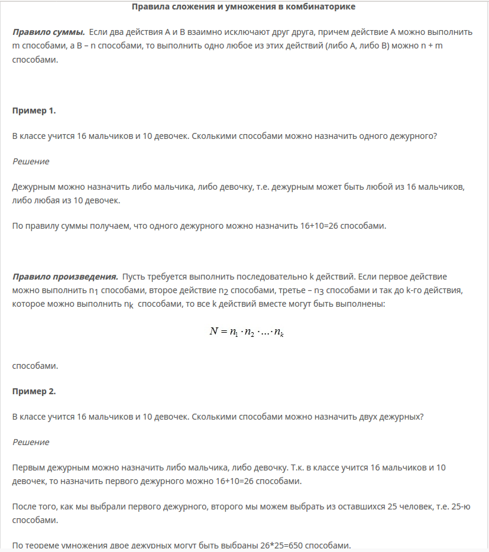
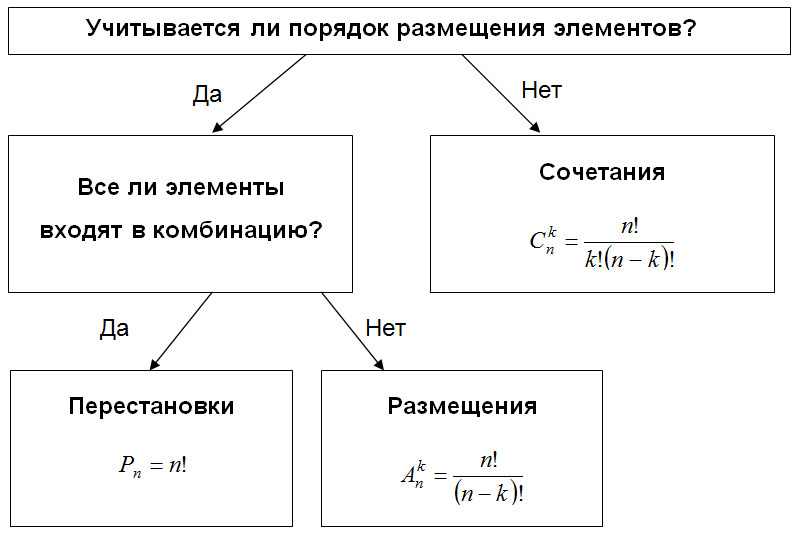
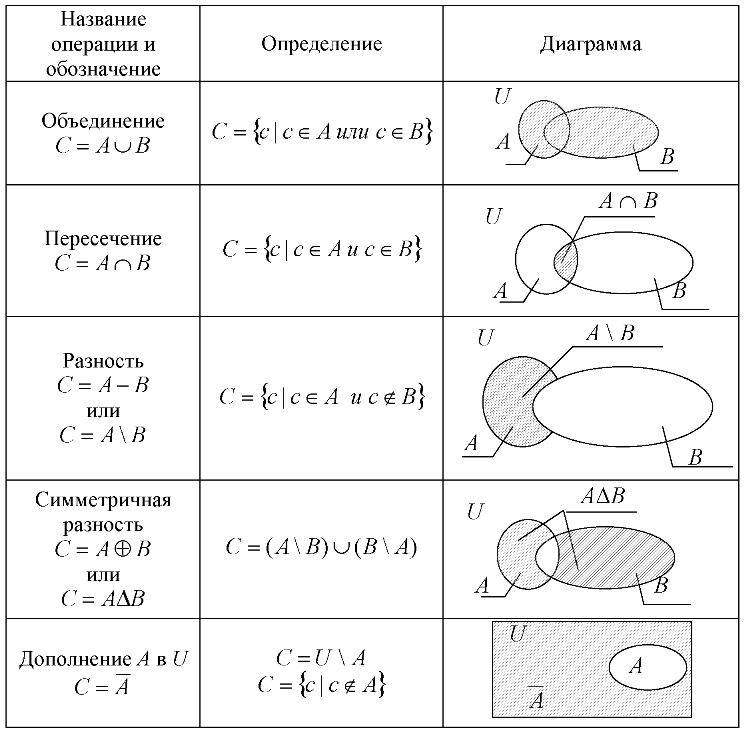
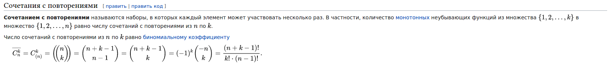
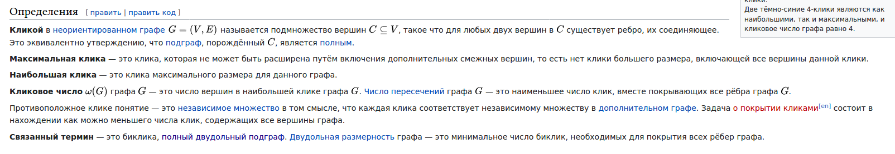

### 2.3. Комбинаторика

[Курс по комбинаторике от физтеха](https://ru.coursera.org/learn/modern-combinatorics)

[Курс по теории графов от физтеха](https://www.coursera.org/learn/teoriya-grafov)

1. [Основные правила комбинаторики: правило сложения, умножения](#вопрос-1). Основные комбинаторные объекты: сочетания и размещения с повторениями и без повторений. Формулы для количества  сочетаний и размещений. Принцип Дирихле. Примеры.

2. [Множества](#вопрос-2). Круги Эйлера, операции на множествах. Формулавключений и исключений. Примеры.

3. [Сочетания](#вопрос-3). Размещения, перестановки и сочетания. Бином Ньютона. Треугольник Паскаля. Сочетания с повторениями.

4. [Графы: неориентированные, ориентированные, простые графы, мультиграфы и псевдографы](#вопрос-4). Изоморфизм графов. Некоторые стандартные классы графов: полные, двудольные, цепи, циклы, деревья. Критерий двудольности графа.

5. [Деревья](#вопрос-5). Связь между количеством вершин и рёбер. Эквивалентные определения класса деревьев. Формула Кэли для числа деревьев на фиксированном множестве вершин.

6. [Кликовое число, число независимости, хроматическое число; связь между этими числами](#вопрос-6). Жадный алгоритм раскраски графа, пример его неоптимальности.

### Вопрос 1

**Основные правила комбинаторики: правило сложения, умножения. Основные комбинаторные объекты: сочетания и размещения с повторениями и без повторений. Формулы для количества сочетаний и размещений. Принцип Дирихле. Примеры.**

Принцип Дирихле: Если кролики рассажены в клетки, причём число кроликов больше числа клеток, то хотя бы в одной из клеток находится более одного кролика.

### Вопрос 2

**Множества. Круги Эйлера, операции на множествах. Формула включений и исключений. Примеры.**

Мноожество — математический объект, сам являющийся набором каких-либо объектов, которые называются элементами этого множества и обладают общим для всех их характеристическим свойством.

Кругии Э́йлера — геометрическая схема, с помощью которой можно изобразить отношения между подмножествами, для наглядного представления.

Формула включений и исключений:

|A + B| = |A| + |B| - |A * B|

### Вопрос 3

**Сочетания. Размещения, перестановки и сочетания. Бином Ньютона. Треугольник Паскаля. Сочетания с повторениями.**

[Размещения, перестановки и сочетания](#вопрос-1)

[Бином Ньютона](https://ru.wikipedia.org/wiki/%D0%91%D0%B8%D0%BD%D0%BE%D0%BC_%D0%9D%D1%8C%D1%8E%D1%82%D0%BE%D0%BD%D0%B0)

[Треугольник Паскаля](https://ru.wikipedia.org/wiki/%D0%A2%D1%80%D0%B5%D1%83%D0%B3%D0%BE%D0%BB%D1%8C%D0%BD%D0%B8%D0%BA_%D0%9F%D0%B0%D1%81%D0%BA%D0%B0%D0%BB%D1%8F)

### Вопрос 4

**Графы: неориентированные, ориентированные, простые графы, мультиграфы и псевдографы. Изоморфизм графов. Некоторые стандартные классы графов: полные, двудольные, цепи, циклы, деревья. Критерий двудольности графа.**

[Графы, основные понятия](https://neerc.ifmo.ru/wiki/index.php?title=%D0%9E%D1%81%D0%BD%D0%BE%D0%B2%D0%BD%D1%8B%D0%B5_%D0%BE%D0%BF%D1%80%D0%B5%D0%B4%D0%B5%D0%BB%D0%B5%D0%BD%D0%B8%D1%8F_%D1%82%D0%B5%D0%BE%D1%80%D0%B8%D0%B8_%D0%B3%D1%80%D0%B0%D1%84%D0%BE%D0%B2)

[Двудольные графы](https://neerc.ifmo.ru/wiki/index.php?title=%D0%94%D0%B2%D1%83%D0%B4%D0%BE%D0%BB%D1%8C%D0%BD%D1%8B%D0%B5_%D0%B3%D1%80%D0%B0%D1%84%D1%8B)

[Теория графов](https://neerc.ifmo.ru/wiki/index.php?title=%D0%A2%D0%B5%D0%BE%D1%80%D0%B8%D1%8F_%D0%B3%D1%80%D0%B0%D1%84%D0%BE%D0%B2)

Критерий двудольности: граф является двудольным тогда и только тогда, когда он не содержит цикла нечётной длины.

Для того, чтобы проверить граф на предмет двудольности, достаточно в каждой компоненте связности выбрать любую вершину и помечать оставшиеся вершины во время обхода графа (например, поиском в ширину) поочерёдно как чётные и нечётные. Если при этом не возникнет конфликта, все чётные вершины образуют множество U, а все нечётные — V.

### Вопрос 5

**Деревья. Связь между количеством вершин и рёбер. Эквивалентные определения класса деревьев. Формула Кэли для числа деревьев на фиксированном множестве вершин.**

Дерево — структура данных, эмулирующая древовидную структуру в виде набора связанных узлов. Является связным графом, не содержащим циклы. Большинство источников также добавляют условие на то, что рёбра графа не должны быть ориентированными. В дополнение к этим трём ограничениям, в некоторых источниках указывается, что рёбра графа не должны быть взвешенными.

Число рёбер в дереве на единицу меньше числа вершин, а между любыми парами вершин имеется один и только один путь.

[Эквивалентные определения](https://neerc.ifmo.ru/wiki/index.php?title=%D0%94%D0%B5%D1%80%D0%B5%D0%B2%D0%BE,_%D1%8D%D0%BA%D0%B2%D0%B8%D0%B2%D0%B0%D0%BB%D0%B5%D0%BD%D1%82%D0%BD%D1%8B%D0%B5_%D0%BE%D0%BF%D1%80%D0%B5%D0%B4%D0%B5%D0%BB%D0%B5%D0%BD%D0%B8%D1%8F)

[Теорема Кэли](https://ru.wikipedia.org/wiki/%D0%A2%D0%B5%D0%BE%D1%80%D0%B5%D0%BC%D0%B0_%D0%9A%D1%8D%D0%BB%D0%B8_%D0%BE_%D1%87%D0%B8%D1%81%D0%BB%D0%B5_%D0%B4%D0%B5%D1%80%D0%B5%D0%B2%D1%8C%D0%B5%D0%B2)

Число различных деревьев на n вершинах, пронумерованных числами от 1 до n равно n^(n − 2).

### Вопрос 6

**Кликовое число, число независимости, хроматическое число; связь между этими числами. Жадный алгоритм раскраски графа, пример его неоптимальности.**

Число независимости графа — это количество вершин в любом максимальном по мощности независимом множестве вершин этого графа.

Хроматическое число графа — минимальное число цветов, в которые можно раскрасить вершины графа так, чтобы концы любого ребра имели разные цвета.

связь ???

[Алгортм раскраски](https://ru.wikipedia.org/wiki/%D0%96%D0%B0%D0%B4%D0%BD%D0%B0%D1%8F_%D1%80%D0%B0%D1%81%D0%BA%D1%80%D0%B0%D1%81%D0%BA%D0%B0)
