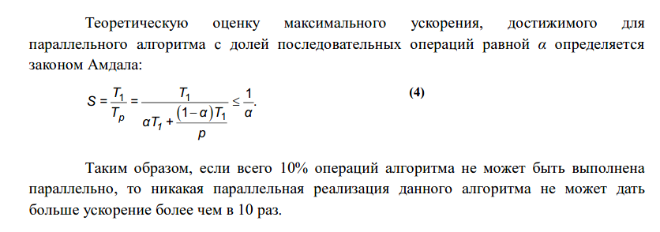

### 2.4. Компьютерные науки

1. [Регулярные выражения.](#вопрос-1) Теорема Клини об эквивалентности  регулярных выражений и конечных автоматов.

2. [Контекстно-свободные грамматики](#вопрос-2). Автоматы с магазинной памятью. Эквивалентность автоматов с магазинной памятью и контекстно-свободных грамматик.

3. [Архитектура Фон-Неймана](#вопрос-3). Принципы однородности памяти, адресности и программного управления. Гарвардская архитектура, отличия от архитектуры Фон-Неймана. Примеры реализаций.

4. [Абстрактные структуры данных](#вопрос-4): списка, вектора, деревья поиска. Их асимптотики для операций поиска элемента и вставки новых элементов в середину или конец. Примеры реализаций

5. [Целочисленная арифметика в представлении компьютера](#вопрос-5). Знаковые и беззнаковые значения, способы представления отрицательных значений. Целочисленное переполнение и его контроль. Длинная целочисленная арифметика.

6. [Вещественная арифметика](#вопрос-6). Представления с фиксированной и  плавающей точкой. Стандарт IEEE754. Специальные вещественные значения, определенные стандартом IEEE754 и операции над ними.

7. [Устройство виртуального адресного пространства процесса](#вопрос-7). Стек и куча. Динамическая загрузка библиотек. Механизм трансляции адресов из виртуального в физическое адресное пространство.

8. [Операционные системы и их компоненты](#вопрос-8). Ядро операционных систем. Системные вызовы и их отличия от обычных библиотечных функций. Способы реализации системных вызовов (прерывания, sysenter, syscall).

9. [Процессы и потоки](#вопрос-9). Сходства и различия между ними. Реализация многозадачности и алгоритмы планирование задач в операционных системах.

10. [Проблема многопоточной синхронизации](#вопрос-10). Атомарные переменные и объекты блокировки. Неблокирующие структуры данных и их реализация.

11. [Интерконнект в вычислительном кластере](#вопрос-11). Отличие интерконнекта от глобальных компьютерных сетей. Основные характеристики интерконнекта. Топологии соединений узлов в  вычислительном кластере, характеристики топологий.

12. [Понятие ускорения и масштабируемости параллельных программ](#вопрос-12). Закон Амдала. Оценка  эффективности параллельных программ. Ярусно-параллельная форма программы.

13. [Параллельные и распределённые вычислительные системы](#вопрос-13). Парадигма Map-Reduce. Примеры, отличия. Распределенные файловые системы. Особенности хранения файлов в них. Репликация.

### Вопрос 1

**Регулярные выражения. Теорема Клини об эквивалентности регулярных выражений и конечных автоматов.**

[Регулярные языки](https://neerc.ifmo.ru/wiki/index.php?title=%D0%A0%D0%B5%D0%B3%D1%83%D0%BB%D1%8F%D1%80%D0%BD%D1%8B%D0%B5_%D1%8F%D0%B7%D1%8B%D0%BA%D0%B8:_%D0%B4%D0%B2%D0%B0_%D0%BE%D0%BF%D1%80%D0%B5%D0%B4%D0%B5%D0%BB%D0%B5%D0%BD%D0%B8%D1%8F_%D0%B8_%D0%B8%D1%85_%D1%8D%D0%BA%D0%B2%D0%B8%D0%B2%D0%B0%D0%BB%D0%B5%D0%BD%D1%82%D0%BD%D0%BE%D1%81%D1%82%D1%8C)
[Регулярная грамматика](https://ru.wikipedia.org/wiki/%D0%A0%D0%B5%D0%B3%D1%83%D0%BB%D1%8F%D1%80%D0%BD%D0%B0%D1%8F_%D0%B3%D1%80%D0%B0%D0%BC%D0%BC%D0%B0%D1%82%D0%B8%D0%BA%D0%B0)
[Регулярный язык](https://ru.wikipedia.org/wiki/%D0%A0%D0%B5%D0%B3%D1%83%D0%BB%D1%8F%D1%80%D0%BD%D1%8B%D0%B9_%D1%8F%D0%B7%D1%8B%D0%BA)
[Теорема Клини](https://ru.wikipedia.org/wiki/%D0%A2%D0%B5%D0%BE%D1%80%D0%B5%D0%BC%D0%B0_%D0%9A%D0%BB%D0%B8%D0%BD%D0%B8)

Регулярные выражения — специальный язык для описания шаблонов строк, основанный на использовании метасимволов. Для поиска используется строка-образец (pattern), состоящая из символов и метасимволов и задающая правило поиска. 

Теорема Клини утверждает, что класс регулярных языков совпадает с классом языков распознаваемых конечным автоматом. Это значит, что для любого конечного автомата множество слов, которое он допускает является регулярным языком. И обратно, для любого регулярного языка существует автомат, которые допускает слова из этого языка и только их.

### Вопрос 2

**Контекстно-свободные грамматики. Автоматы с магазинной памятью. Эквивалентность автоматов с магазинной памятью и контекстно-свободных грамматик.**

[КС грамматика](https://neerc.ifmo.ru/wiki/index.php?title=%D0%9A%D0%BE%D0%BD%D1%82%D0%B5%D0%BA%D1%81%D1%82%D0%BD%D0%BE-%D1%81%D0%B2%D0%BE%D0%B1%D0%BE%D0%B4%D0%BD%D1%8B%D0%B5_%D0%B3%D1%80%D0%B0%D0%BC%D0%BC%D0%B0%D1%82%D0%B8%D0%BA%D0%B8,_%D0%B2%D1%8B%D0%B2%D0%BE%D0%B4,_%D0%BB%D0%B5%D0%B2%D0%BE-_%D0%B8_%D0%BF%D1%80%D0%B0%D0%B2%D0%BE%D1%81%D1%82%D0%BE%D1%80%D0%BE%D0%BD%D0%BD%D0%B8%D0%B9_%D0%B2%D1%8B%D0%B2%D0%BE%D0%B4,_%D0%B4%D0%B5%D1%80%D0%B5%D0%B2%D0%BE_%D1%80%D0%B0%D0%B7%D0%B1%D0%BE%D1%80%D0%B0)
[КС грамматика](https://ru.wikipedia.org/wiki/%D0%9A%D0%BE%D0%BD%D1%82%D0%B5%D0%BA%D1%81%D1%82%D0%BD%D0%BE-%D1%81%D0%B2%D0%BE%D0%B1%D0%BE%D0%B4%D0%BD%D0%B0%D1%8F_%D0%B3%D1%80%D0%B0%D0%BC%D0%BC%D0%B0%D1%82%D0%B8%D0%BA%D0%B0)
[МП автоматы](https://ru.wikipedia.org/wiki/%D0%90%D0%B2%D1%82%D0%BE%D0%BC%D0%B0%D1%82_%D1%81_%D0%BC%D0%B0%D0%B3%D0%B0%D0%B7%D0%B8%D0%BD%D0%BD%D0%BE%D0%B9_%D0%BF%D0%B0%D0%BC%D1%8F%D1%82%D1%8C%D1%8E)
[МП автоматы](https://neerc.ifmo.ru/wiki/index.php?title=%D0%90%D0%B2%D1%82%D0%BE%D0%BC%D0%B0%D1%82%D1%8B_%D1%81_%D0%BC%D0%B0%D0%B3%D0%B0%D0%B7%D0%B8%D0%BD%D0%BD%D0%BE%D0%B9_%D0%BF%D0%B0%D0%BC%D1%8F%D1%82%D1%8C%D1%8E)
[Эквивалетность](https://neerc.ifmo.ru/wiki/index.php?title=%D0%A1%D0%BE%D0%B2%D0%BF%D0%B0%D0%B4%D0%B5%D0%BD%D0%B8%D0%B5_%D0%BC%D0%BD%D0%BE%D0%B6%D0%B5%D1%81%D1%82%D0%B2%D0%B0_%D1%8F%D0%B7%D1%8B%D0%BA%D0%BE%D0%B2_%D0%9C%D0%9F-%D0%B0%D0%B2%D1%82%D0%BE%D0%BC%D0%B0%D1%82%D0%BE%D0%B2_%D0%B8_%D0%BA%D0%BE%D0%BD%D1%82%D0%B5%D0%BA%D1%81%D1%82%D0%BD%D0%BE-%D1%81%D0%B2%D0%BE%D0%B1%D0%BE%D0%B4%D0%BD%D1%8B%D1%85_%D1%8F%D0%B7%D1%8B%D0%BA%D0%BE%D0%B2)

### Вопрос 3

**Архитектура Фон-Неймана. Принципы однородности памяти, адресности и программного управления. Гарвардская архитектура, отличия от архитектуры Фон-Неймана. Примеры реализаций.**

Машина фон Неймана является абстрактной моделью ЭВМ, однако, эта абстракция отличается от абстрактных исполнителей алгоритмов (например, машины Тьюринга). Если машину Тьюринга принципиально нельзя реализовать из-за входящей в её архитектуру бесконечной ленты, то машина фон Неймана не поддаётся реализации, так как многие детали в архитектуре этой машины не конкретизированы. 

ПАМЯТЬ.

Принцип линейности и однородности памяти.

Память – линейная (упорядоченная) однородная последовательность некоторых элементов, называемых ячейками. В любую ячейку памяти другие устройства машины  могут записать и считать информацию, причём время чтения/записи из/в любой ячейки одинаково для всех ячеек.

Принцип неразличимости команд и данных.

Машинное слово представляет собой либо команду, либо подлежащее обработке данное (для краткости – числа). Данный принцип фон Неймана заключается в том, что числа и команды неотличимы друг от друга – в памяти и те и другое представляются некоторым набором разрядов, причём по внешнему виду машинного слова нельзя определить, что оно представляет – команду или число.

Принцип хранимой программы.

Cуть состоит в том, что программа хранится в памяти вместе с числами, а значит, может изменяться во время счёта этой программы. Говорят также, что программа может самомодифицироваться во время счёта.

УСТРОЙСТВО УПРАВЛЕНИЯ (УУ)

Принцип автоматической работы.

Машина, выполняя записанную в её памяти программу, функционирует автоматически, без участия человека.

Принцип последовательного выполнения команд.

УУ выполняет некоторую команду от начала до конца, а затем по определённому правилу выбирает следующую команду для выполнения, затем следующую и т.д. Этот процесс продолжается, пока не будет выполнена специальная команда останова, либо при выполнении очередной команды не возникнет аварийная ситуация (например, деление на ноль).

АРИФМЕТИКО-ЛОГИЧЕСКОЕ УС-ВО (АЛУ)

В архитектуре машины фон Неймана АЛУ может выполнить следующие действия.
1. Считать содержимое некоторой ячейки памяти – поместить копию машинного слова из этой
ячейки в ячейку, расположенную в самом АЛУ.
2. Записать в некоторую ячейку памяти – поместить копию содержимого регистра АЛУ в ячейку памяти.
3. АЛУ может также выполнять различные операции над данными в своих регистрах, например,
сложить содержимое двух регистров (обычно называемых регистрами первого R1 и второго R2
операндов), и поместить результат на третий регистр (называемый, как правило, сумматором S).

Революционность идей фон Неймана заключалась в специализации: каждое устройство отвечает за выполнение только своих функций. Теперь память только хранила данные, АЛУ производило арифметико-логические операции над ними, устройство ввода только вводило данные из «внешнего мира»  в память и т.д. Фон Нейман распределил функции между различными устройствами, что существенно упростило схему машины.

Гарвардская и принстонская архитектуры

Их основное отличие заключалось в том, что архитектура фон Неймана использовала единую память (общую шину данных), а гарвардская предполагала наличие нескольких шин (в оригинале две: шина данных и шина команд).

В чистой архитектуре фон Неймана процессор в каждый момент времени может либо читать инструкцию, либо читать/записывать единицу данных из/в памяти. Оба действия одновременно происходить не могут, поскольку инструкции и данные используют один и тот же поток (шину).
В компьютере с использованием гарвардской архитектуры процессор может считывать очередную команду и оперировать памятью данных одновременно и без использования кэш-памяти. Таким образом, компьютер с гарвардской архитектурой при определенной сложности схемы быстрее, чем компьютер с архитектурой фон Неймана, поскольку потоки команд и данных расположены на раздельных физически не связанных между собой аппаратных каналах.

Исходя из физического разделения шин команд и данных, разрядности этих шин (следовательно, и адресные пространства) могут различаться и физически не могут пересекаться.

Основным преимуществом архитектуры Фон Неймана является то, что она упрощает устройство микропроцессора, так как реализует обращение только к одной общей памяти.

Гарвардская архитектура выполняет команды за меньшее количество так­тов, чем архитектура Фон Неймана. Это обусловлено тем, что в Гарвардской архитектуре больше возможностей для реализации параллельных операций. Выборка следующей команды может происходить одновременно с выполне­нием предыдущей команды, и нет необходимости останавливать процессор на время выборки команды.

ПРИМЕРЫ

Гарвардская: микроконтроллеры (PIC, AVR), цифровой сигнальный процессор

Принстонская: пк

### Вопрос 4

Абстрактные структуры данных: списка, вектора, деревья поиска. Их асимптотики для операций поиска элемента и вставки новых элементов в середину или конец. Примеры реализаций

Список — СД, состоящая из узлов, каждый из которых содержит как собственно данные, так и одну или две ссылки на следующий и/или предыдущий узел списка.

Вектор -- упорядоченный набор элементов с произвольным доступом по числовому индексу.

Дерево поиска -- двоичное дерево, для которого выполняются следующие дополнительные условия (свойства дерева поиска):
- Оба поддерева -- левое и правое -- являются двоичными деревьями поиска.
- У всех узлов левого поддерева произвольного узла X значения ключей данных меньше либо равны, нежели значение ключа данных самого узла X.
- У всех узлов правого поддерева произвольного узла X значения ключей данных больше либо равны, нежели значение ключа данных самого узла X.

### Вопрос 5

Целочисленная арифметика в представлении компьютера. Знаковые и беззнаковые значения, способы представления отрицательных значений. Целочисленное переполнение и его контроль. Длинная целочисленная арифметика.

[Целый тип](https://ru.wikipedia.org/wiki/%D0%A6%D0%B5%D0%BB%D0%BE%D0%B5_(%D1%82%D0%B8%D0%BF_%D0%B4%D0%B0%D0%BD%D0%BD%D1%8B%D1%85)

[Обратный код](https://ru.wikipedia.org/wiki/%D0%9E%D0%B1%D1%80%D0%B0%D1%82%D0%BD%D1%8B%D0%B9_%D0%BA%D0%BE%D0%B4)

[Дополнительный код](https://ru.wikipedia.org/wiki/%D0%94%D0%BE%D0%BF%D0%BE%D0%BB%D0%BD%D0%B8%D1%82%D0%B5%D0%BB%D1%8C%D0%BD%D1%8B%D0%B9_%D0%BA%D0%BE%D0%B4)

[Переполнение](https://ru.wikipedia.org/wiki/%D0%A6%D0%B5%D0%BB%D0%BE%D1%87%D0%B8%D1%81%D0%BB%D0%B5%D0%BD%D0%BD%D0%BE%D0%B5_%D0%BF%D0%B5%D1%80%D0%B5%D0%BF%D0%BE%D0%BB%D0%BD%D0%B5%D0%BD%D0%B8%D0%B5)

[Длинка](https://e-maxx.ru/algo/big_integer)

### Вопрос 6
Вещественная арифметика. Представления с фиксированной и  плавающей точкой. Стандарт IEEE754. Специальные вещественные значения, определенные стандартом IEEE754 и операции над ними.

[Вещественная арифметика](https://habr.com/ru/post/112953/)

[Представление вещественных чисел](https://neerc.ifmo.ru/wiki/index.php?title=%D0%9F%D1%80%D0%B5%D0%B4%D1%81%D1%82%D0%B0%D0%B2%D0%BB%D0%B5%D0%BD%D0%B8%D0%B5_%D0%B2%D0%B5%D1%89%D0%B5%D1%81%D1%82%D0%B2%D0%B5%D0%BD%D0%BD%D1%8B%D1%85_%D1%87%D0%B8%D1%81%D0%B5%D0%BB)

[Стандарт IEEE754](http://floatingpoint.ru/ieee754.html)

[Стандарт IEEE754](https://foxford.ru/wiki/informatika/standart-ieee-754-ispolzovanie-bit-pri-hranenii-chisel-s-plavayuschey-tochkoy)

### Вопрос 7

Устройство виртуального адресного пространства процесса. Стек и куча. Динамическая загрузка библиотек. Механизм трансляции адресов из виртуального в физическое адресное пространство.

[Виртуальная память](https://drive.google.com/drive/folders/1NJOswPvRen2eRs7UXMUFffTt6W53qrNV)

### Вопрос 8

Операционные системы и их компоненты. Ядро операционных систем. Системные вызовы и их отличия от обычных библиотечных функций. Способы реализации системных вызовов (прерывания, sysenter, syscall).

[Операционные системы](https://drive.google.com/drive/folders/1O6lCS9ZYlcZMyDYmnLz4kpyiU7tKNlZl)

Отличие от обычных библиотечных функцй -- сисколы вполняются в пространстве ядра, а библиотечные функции в пространстве пользователя.

[Реализация сисколов](https://ru.qwe.wiki/wiki/System_call#Typical_implementations)

### Вопрос 9

Процессы и потоки. Сходства и различия между ними. Реализация многозадачности и алгоритмы планирование задач в операционных системах.

Процесс -- абстракция, описывающая программу во время ее исполнения.

Поток -- разновидность процесса внутри процесса.

[Алгоритмы планирования](https://drive.google.com/drive/folders/1NJOswPvRen2eRs7UXMUFffTt6W53qrNV)

### Вопрос 10

Проблема многопоточной синхронизации. Атомарные переменные и объекты блокировки. Неблокирующие структуры данных и их реализация.

Типовые проблемы
* Состояние «гонки» (race condition)
* Взаимная блокировка (deadlock)
* Плохая масштабируемость из-за конфликтах на блокировках (lock contention)
* Активная блокировка (live lock) – «имитация бурной деятельности»

[Атомарные переменные](https://habr.com/ru/post/147099/)

[Неблокирующая синхронизация](https://ru.wikipedia.org/wiki/%D0%9D%D0%B5%D0%B1%D0%BB%D0%BE%D0%BA%D0%B8%D1%80%D1%83%D1%8E%D1%89%D0%B0%D1%8F_%D1%81%D0%B8%D0%BD%D1%85%D1%80%D0%BE%D0%BD%D0%B8%D0%B7%D0%B0%D1%86%D0%B8%D1%8F)

[Неблокирующие структуры данных](https://habr.com/ru/post/219201/)

### Вопрос 11

Интерконнект в вычислительном кластере. Отличие интерконнекта от глобальных компьютерных сетей. Основные характеристики интерконнекта. Топологии соединений узлов в вычислительном кластере, характеристики топологий.

Интерконнект представляет собой сеть (или несколько сетей), предназначенную для взаимодействия мастера и сегментов между собой. Когда пользователь подключается к базе данных и запускает SQL запрос, на каждом из сегментов создаются процессы для обработки данного запроса. Интерконнект является как связью сегментов внутри одного хоста, так и между сегментами на разных серверах.

Interconnect (соединитель)
- Соединяет процессоры и память разных уровней (включая кэши)
- набор аппаратных соединений, имеющих определенную пропускную способность
- Если не хватает, процессор просто будет ждать!
- SMP(symmetric multi processing)
- NUMA(non uniform memory access). 

Глобальная компьютерная сеть -- компьютерная сеть, охватывающая большие территории и включающая в себя большое число компьютеров. ГКС служат для объединения разрозненных сетей так, чтобы пользователи и компьютеры, где бы они ни находились, могли взаимодействовать со всеми остальными участниками глобальной сети.

Характеристики???

Топологии кластеров:

* Топология кластерных пар. Узлы группируются попарно. Дисковые массивы присоединяются к обоим узлам пары, причем каждый узел имеет доступ ко всем дисковым массивам своей пары. Один из узлов является резервным для другого. Четырехузловая кластерная «пара» представляет собой простое расширение двухузловой топологии. Обе кластерные пары с точки зрения администрирования и настройки рассматриваются как единое целое. Эта топология подходит для организации кластеров с высокой готовностью данных, но отказоустойчивость реализуется только в пределах пары, так как принадлежащие ей устройства хранения информации не имеют физического соединения с другой парой.

* Топология N + 1. Каждый дисковый массив подключается только к двум узлам кластера. Дисковые массивы организованы по схеме RAID 1. Один сервер имеет соединение со всеми дисковыми массивами и служит в качестве резервного для всех остальных узлов. Резервный сервер может использоваться для поддержания высокой степени готовности в паре с любым из активных узлов. Топология рекомендуется для организации кластеров высокой готовности. В тех конфигурациях, где имеется возможность выделить один узел для резервирования, эта топология способствует уменьшению нагрузки на активные узлы и гарантирует, что нагрузка вышедшего из строя узла будет воспроизведена на резервном узле без потери производительности. Отказоустойчивость обеспечивается между любым из основных узлов и резервным узлом. В то же время топология не позволяет реализовать глобальную отказоустой-чивость, поскольку основные узлы кластера и их системы хранения информа- ции не связаны друг с другом.

* Топология NN. Аналогично топологии N + 1, топология NN позволяет создавать кластеры из 2-, 3- и 4-х узлов, но в отличие от первой обладает большей гибкостью и масштабируемостью. Только в этой топологии все узлы кластера имеют доступ ко всем дисковым массивам, которые, в свою очередь, строятся по схеме RAID 1 (с дублированием). Масштабируемость топологии проявляется в простоте добавления к кластеру дополнительных узлов и дисковых массивов без изменения соединений в существующей системе. Топология позволяет организовать каскадную систему отказоустойчивости, при которой обработка переносится с неисправного узла на резервный, а в случае его выхода из строя на следующий резервный узел и т.д. В целом топология обладает лучшей отказоустойчивостью и гибкостью по сравнению с другими топологиями.

* Топология с полностью раздельным доступом. В топологии с полностью раздельным доступом каждый дисковый массив соединяется только с одним узлом кластера. Топология рекомендуется только для тех приложений, для которых характерна архитектура полностью раздельного доступа.

### Вопрос 12

Понятие ускорения и масштабируемости параллельных программ. Закон Амдала. Оценка эффективности параллельных программ. Ярусно-параллельная форма программы.

Параллельная программа – это множество взаимодействующих параллельных процессов. Основной целью параллельных вычислений является ускорение решения вычислительных задач.

Ускорением параллельного алгоритма называют отношение времени выполнения лучшего последовательного алгоритмам к времени выполнения параллельного алгоритма:

S = T_1 / T_p

Параллельный  алгоритм  может  давать  большое  ускорение,  но  использовать  для этого множество процессов неэффективно. Для оценки масштабируемости параллельного алгоритма используется понятие эффективности:

E = S / p

p -- процессор

Ярусно-Параллельная Форма информационного графа алгоритма -- форма представления графа, при которой операторы, могущиеся выполняться независимо друг от друга (фактически параллельно) располагаются на одном уровне (ярусе). Представление графа в ЯПФ -- одно из наиболее мощных средств выявления скрытого параллелизма в алгоритме.

Высота ЯПФ (вычисляемая чрез число ярусов) определяет общее время выполнения алгоритма, ширина ЯПФ – максимальное число задействованных отдельных (параллельно работающих) вычислителей (напр, отдельных ядер процессора) данной МВС.

### Вопрос 13

Параллельные и распределённые вычислительные системы. Парадигма Map-Reduce. Примеры, отличия. Распределенные файловые системы. Особенности хранения файлов в них. Репликация.

[Параллельные вычислительные системы](https://ru.wikipedia.org/wiki/%D0%9F%D0%B0%D1%80%D0%B0%D0%BB%D0%BB%D0%B5%D0%BB%D1%8C%D0%BD%D1%8B%D0%B5_%D0%B2%D1%8B%D1%87%D0%B8%D1%81%D0%BB%D0%B8%D1%82%D0%B5%D0%BB%D1%8C%D0%BD%D1%8B%D0%B5_%D1%81%D0%B8%D1%81%D1%82%D0%B5%D0%BC%D1%8B) — это физические компьютерные, а также программные системы, реализующие тем или иным способом параллельную обработку данных на многих вычислительных узлах.

[Распределённые вычисления](https://ru.wikipedia.org/wiki/%D0%A0%D0%B0%D1%81%D0%BF%D1%80%D0%B5%D0%B4%D0%B5%D0%BB%D1%91%D0%BD%D0%BD%D1%8B%D0%B5_%D0%B2%D1%8B%D1%87%D0%B8%D1%81%D0%BB%D0%B5%D0%BD%D0%B8%D1%8F) — способ решения трудоёмких вычислительных задач с использованием нескольких компьютеров, чаще всего объединённых в параллельную вычислительную систему.

[MapReduce](https://ru.wikipedia.org/wiki/MapReduce) — модель распределённых вычислений, представленная компанией Google, используемая для параллельных вычислений над очень большими наборами данных в компьютерных кластерах.

На Map-шаге происходит предварительная обработка входных данных. Для этого один из компьютеров (называемый главным узлом — master node) получает входные данные задачи, разделяет их на части и передает другим компьютерам (рабочим узлам — worker node) для предварительной обработки.

На Reduce-шаге происходит свёртка предварительно обработанных данных. Главный узел получает ответы от рабочих узлов и на их основе формирует результат — решение задачи, которая изначально формулировалась.

[Распределенные файловые системы](https://parallel.ru/krukov/lec5.html)

Основная идея распределенной файловой системы состоит в том, чтобы обеспечить совместный доступ к файлам локальной файловой системы для процессов, которые, вообще говоря, выполняются на других компьютерах. Эта идея может быть реализована многими разными способами, однако в среде ОС UNIX все известные подходы основываются на монтировании удаленной файловой системы к одному из каталогов локальной файловой системы. После выполнения этой процедуры файлы, хранимые в удаленной файловой системе, доступны процессам локального компьютера точно таким же образом, как если бы они хранились на локальном дисковом устройстве. 

Репликация — это процесс, под которым понимается копирование данных из одного источника на другой (или на множество других) и наоборот.